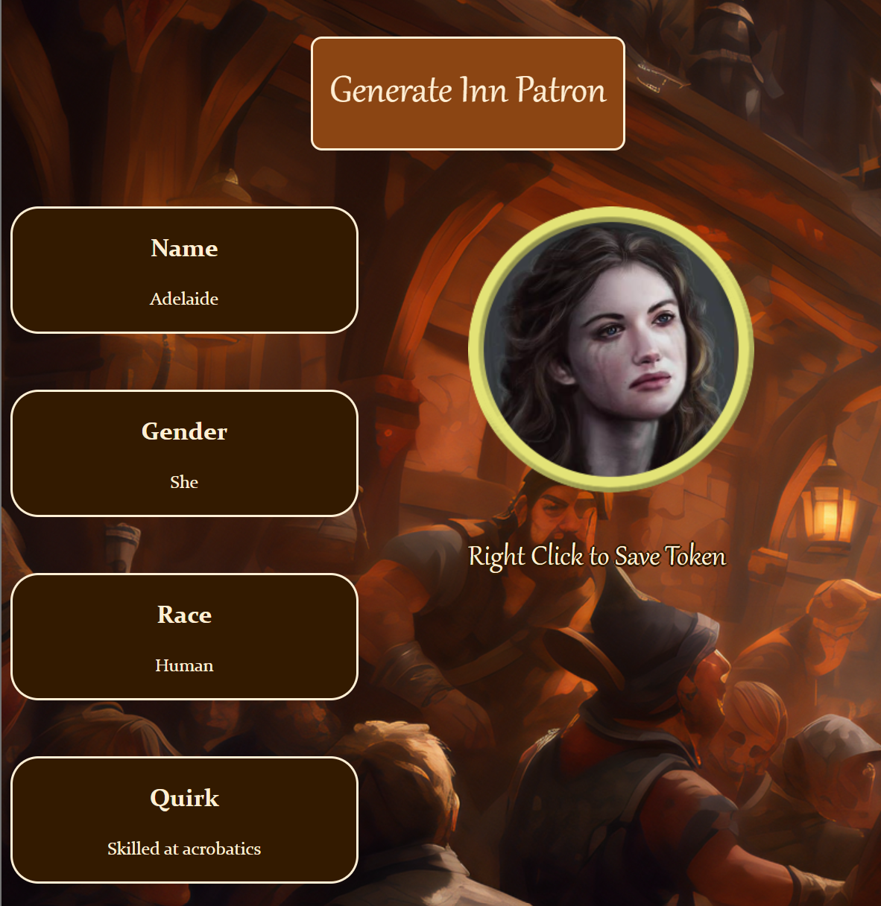
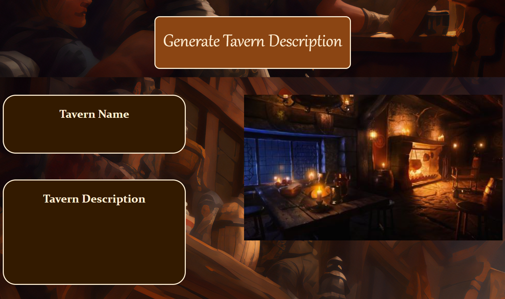
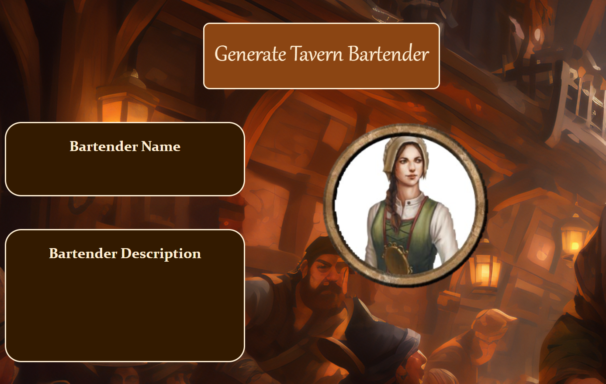

## Tavern Patron Generator

## Why do You Need the Tavern Patron Generator?

Have you ever been Dungeon Mastering your favorite Table-Top Role-Playing Game and your players want to talk to EVERY non-player character (NPC) they come across? Do you not have a plethora of NPCs at the ready? That's where the Tavern Patron Generator comes in. With this tool you can generate NPCs of common races from most fantasy TTRPGs. 

## What Makes an NPC?

This tool will provide you with a name, race & gender. To give the NPC some depth a "quirk" about them is also provided. For your virtual campaigns a random token from the matching race and gender is also provided.

## Generating Taverns and Inn Keepers
Your tavern or inn wouldn’t be complete without a tavern name, description, image and someone to run to the place.

## How to Use

Download the whole repository, making sure to keep files in correct levels and folders. Then open the index.html file to pull up the page to generate NPCs to fill your TTRPG Taverns.

This project was made for TartanHacks 2024 and to help me learn how to use HTML, CSS and JavaScript.

